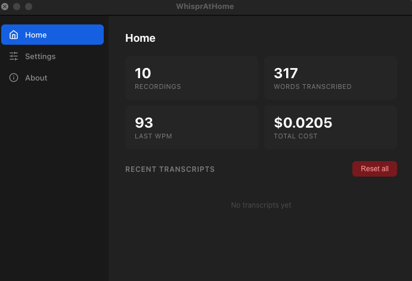
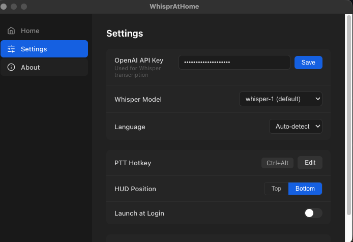
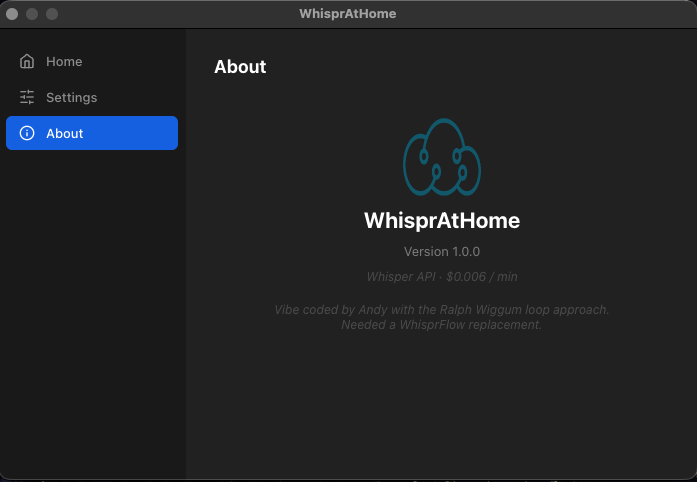

# WhisprAtHome

A push-to-talk speech-to-text tool for macOS and Windows. Hold a hotkey, speak, release — your words are transcribed via OpenAI Whisper and pasted into whatever app is focused.

Built as a personal replacement for Wispr Flow.

> **Transparency note:** This app was vibe coded by Andy using the [Ralph Wiggum loop](https://github.com/snarktank/ralph) by [Snark Tank](https://github.com/snarktank) — an autonomous AI coding agent that iterates on a PRD until everything passes. The code was not written by hand.

---

## Screenshots

| Home | Settings | About |
|:---:|:---:|:---:|
|  |  |  |

---

## How it works

1. Hold your PTT hotkey (default: `Ctrl+Option`)
2. Speak into your microphone
3. Release the hotkey
4. The transcription is pasted into your currently focused text field

A floating HUD shows recording state (red dot + waveform), processing (spinner), and the transcribed text before it's pasted.

---

## Requirements

- **macOS** (arm64 / Apple Silicon) or **Windows** (x64)
- An **OpenAI API key** (or Groq API key)
  - Pricing: $0.006/min for `whisper-1`, see [OpenAI pricing](https://platform.openai.com/docs/pricing) for newer models
  - Get one at [platform.openai.com](https://platform.openai.com)
- Microphone access and Accessibility/paste permissions (prompted on first launch)

---

## Download

Get the latest release: **[v1.1.2](https://github.com/Andy-yun-liang/WisprFlowAtHome/releases/tag/v1.1.2)**

---

### Windows

1. Download `WhisprAtHome Setup 1.1.2.exe` from the [releases page](https://github.com/Andy-yun-liang/WisprFlowAtHome/releases/tag/v1.1.2)
2. Run the installer

> **Windows SmartScreen warning:** Windows may show a "Windows protected your PC" popup because the app is unsigned. Click **"More info"** → **"Run anyway"** to proceed.

3. The Settings window opens automatically — enter your API key and click **Save**
4. Allow microphone access when prompted
5. You're ready — hold `Ctrl+Alt`, speak, release

---

### macOS

1. Download `WhisprAtHome-1.1.2-arm64.dmg` from the [releases page](https://github.com/Andy-yun-liang/WisprFlowAtHome/releases/tag/v1.1.2)
2. Open the DMG, drag **WhisprAtHome** to your Applications folder
3. Launch the app from Applications

> ⚠️ **Important — macOS will say the file is damaged and move it to the Trash.** This happens because the app is unsigned. Do NOT skip this step:
>
> Open Terminal and run:
> ```bash
> xattr -cr /Applications/WhisprAtHome.app
> ```
> Then launch the app again. Alternatively: **System Settings → Privacy & Security → scroll down → "WhisprAtHome was blocked" → Open Anyway**

4. The Settings window opens automatically — enter your OpenAI API key and click **Save**
5. Grant Microphone and Accessibility permissions when prompted
6. You're ready — hold `Ctrl+Option`, speak, release

> macOS note: SoX (audio capture) is bundled inside the app — no Homebrew install needed.

---

## Install — Build from source

### Prerequisites

- [Node.js](https://nodejs.org) 20+
- [npm](https://npmjs.com) 10+

```bash
git clone https://github.com/your-username/WhisprAtHome.git
cd WhisprAtHome
npm install
```

### Run in development mode

```bash
npm run dev
```

The app starts with hot reload. Settings and HUD windows open as normal.

### Build a distributable

```bash
npm run make
```

Output:
- **macOS**: `dist/WhisprAtHome-1.1.2-arm64.dmg`
- **Windows**: `dist/WhisprAtHome Setup 1.1.2.exe`

The build automatically generates all icons, bundles the SoX binary (macOS only), and packages everything via electron-builder.

---

## First-time setup

When the app launches, the **Settings window** opens automatically.

| Setting | Where |
|---|---|
| OpenAI API key | Settings → API Key → Save |
| PTT hotkey | Settings → PTT Hotkey → Edit (default: `Ctrl+Option`) |
| Whisper model | Settings → Whisper Model |
| Language | Settings → Language (default: auto-detect) |
| HUD position | Settings → HUD Position (Top / Bottom) |
| Launch at login | Settings → Launch at Login |
| Remove filler words | Settings → Remove filler words (strips "um", "uh", "like", etc.) |

Your API key is stored in **macOS Keychain** — it never touches disk or any config file.

---

## Permissions

WhisprAtHome requests two permissions:

**Microphone** — required to capture audio when you hold the PTT hotkey. Prompted automatically on first launch.

**Accessibility** — required to paste transcribed text into the focused app. If denied, the text is still copied to your clipboard and a warning is shown in the HUD.

To grant Accessibility manually:
```
System Settings → Privacy & Security → Accessibility → toggle WhisprAtHome on
```

---

## Security

- Your OpenAI API key is stored exclusively in **macOS Keychain** via the system `keytar` API. It is never written to any file.
- No data is sent anywhere except to the OpenAI Whisper API to process your audio.
- Audio is captured locally, sent to Whisper, and discarded — nothing is stored on disk.
- The app is unsigned (no Apple Developer account). The `xattr -cr` command above removes the quarantine flag — it does not bypass any security check beyond that.

---

## Usage stats

The **Home** tab in Settings shows your cumulative usage: recordings, words transcribed, last WPM, and total API cost. It also shows a history of your last 20 transcripts.

---

## Troubleshooting

**App icon shows as Electron default after install**
Clear the macOS icon cache:
```bash
sudo rm -rf /Library/Caches/com.apple.iconservices.store
killall Dock
```

**No audio captured / mic permission error**
Check System Settings → Privacy & Security → Microphone → enable WhisprAtHome.

**Paste doesn't work**
Grant Accessibility permission: System Settings → Privacy & Security → Accessibility → enable WhisprAtHome.

**Transcription is slow**
Switch to `gpt-4o-mini-transcribe` (OpenAI) or `distil-large-v3-en` (Groq) in Settings → Whisper Model — faster with similar accuracy.

---

## License

The application code is MIT licensed. See [LICENSE](LICENSE) for full details.

This app bundles SoX and several audio libraries (LGPL/BSD/GPL). libmad is GPL 2.0 — source code availability via this repository satisfies that requirement. All other bundled libraries are LGPL or more permissive.
